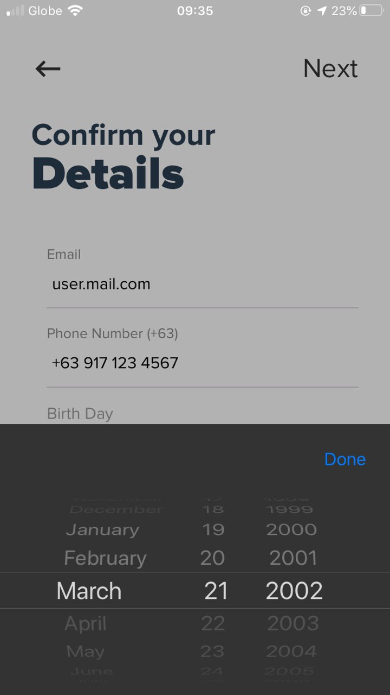
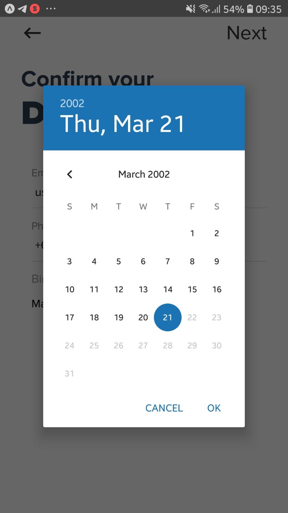

<div align="center">
  

  
</div>

# react-native-datetimepicker-modal

[](https://npmjs.org/package/react-native-datetimepicker-modal)
[](https://npmjs.org/package/react-native-datetimepicker-modal)
[](https://npmjs.org/package/react-native-datetimepicker-modal)
[](http://makeapullrequest.com)
[](https://github.com/arjayosma/react-native-datetimepicker-modal/issues)
[](https://github.com/arjayosma/react-native-datetimepicker-modal/network)
[](https://github.com/arjayosma/react-native-datetimepicker-modal/stargazers)

> React Native DateTimePicker Modal Component for iOS/Android

## Table of Contents

- [react-native-datetimepicker-modal](#react-native-datetimepicker-modal)
  - [Table of Contents](#table-of-contents)
  - [Dependency](#dependency)
  - [Install](#install)
  - [Usage](#usage)
  - [Properties](#properties)
    - [`children`](#children)
    - [`value`](#value)
    - [`modalButtonText`](#modalbuttontext)
    - [Styling](#styling)
  - [Contribute](#contribute)
  - [License](#license)
  - [Credits](#credits)

## Dependency

React Native Community Date/Time Picker (https://github.com/react-native-community/datetimepicker)

## Install

```sh
$ npm i react-native-datetimepicker-modal
$ # OR
$ yarn add react-native-datetimepicker-modal
```

## Usage

```js
import React, { useState } from 'react';
import moment from 'moment';
import { StyleSheet, Text } from 'react-native';
import DateTimePickerModal from 'react-native-datetimepicker-modal';

const Example = () => {
  const [birthDate, setBirthDate] = useState(new Date());
  const [show, showModal] = useState(false);
  const toggle = () => showModal(!show);
  return (
    <DateTimePickerModal
      value={birthDate}
      onChange={(event, date) => setBirthDate(date)}
      show={show}
      toggle={toggle}
    >
      <Text>Birth Day</Text>
      <Text>
        {birthDate ? moment(birthDate).format('MMMM DD, YYYY') : '-'}
      </Text>
    </DateTimePickerModal>
  );
}
```

## Properties

Component accepts the following properties. Please see [propTypes](index.js) for more detail.

Also, please refer to [React Native Community - DateTimePicker](https://github.com/react-native-community/datetimepicker)'s documentation for more details.

### `children`

Component you want to render.

### `value`

Start date for DateTimePicker.

### `modalButtonText`

Text string for the iOS modal button (default: "Done")

### Styling

Styling for different sub-components can also be configured, this is only applicable in iOS:

| Name                   | Description                                  |
| ---------------------- | -------------------------------------------- |
| touchableStyle                  | Styles for the container of `children`     |
| modalButtonStyle       | Styles for the modal button on iOS           |
| modalBtnContainerStyle | Styles for the modal button container on iOS |
| modalStyle             | Styles for the modal on iOS                  |
| modalOverlayStyle      | Styles for the modal overlay on iOS          |

## Contribute

1. Fork it and create your feature branch: git checkout -b my-new-feature
2. Commit your changes: git commit -am 'Add some feature'
3. Push to the branch: git push origin my-new-feature
4. Submit a pull request

## License

MIT

## Credits

Thanks to [@Tiaan](https://github.com/tiaanduplessis) for the [original](https://github.com/tiaanduplessis/react-native-datepicker-modal) idea. I just forked the project to apply the more recent version of RN and **DateTimePicker**.